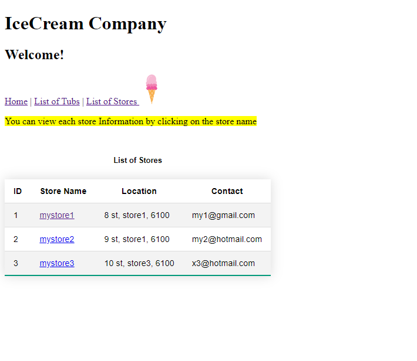
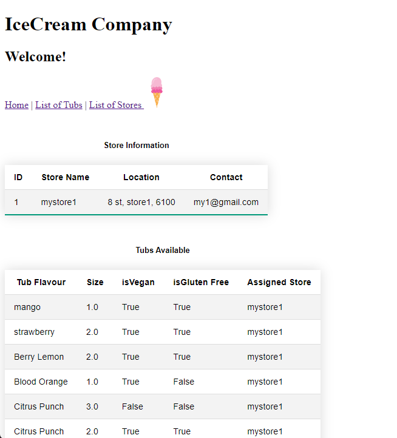
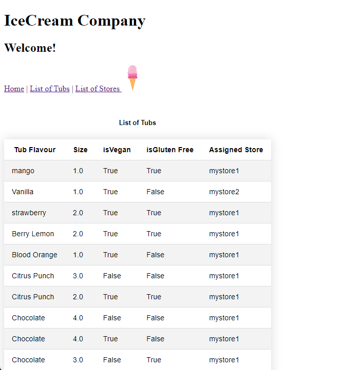

# IceCream Manager Programs

**Description:**
The IceCream Manager Programs provide an interface for admin users to efficiently manage their ice cream store and associated ice tubs.










## How to Run the Application:

1. Install Django requirements:

    ```bash
    pip3 install Django
    ```

2. Run the application:

    ```bash
    python3 manage.py runserver
    ```

**IceCream Admin Account:**
- Username: `icecream`
- Password: `Ice12345`
